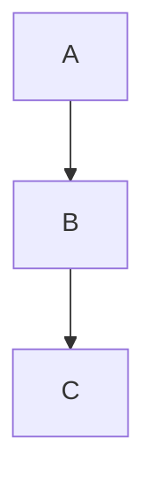

# hold my docs (hmd) — Self-Hosted Wiki

A single-binary, self-hosted wiki. Content lives in a git repository: git is the live source of truth, not a backup. Every save is a commit with auto-push to HTTPS remotes. Split-pane editor with live preview, wiki-links, backlinks, full-text search, and per-page history with revert.

## Quick Start (Docker)

```bash
# Create git_token.txt with your git PAT
echo "your_git_pat_here" > git_token.txt

# Start with docker-compose
docker-compose up
```

Visit http://localhost:8080 and log in with `admin` / `change-me` (see `docker-compose.yaml` to customise).

## Quick Start (Bare Binary)

No Docker required, hmd is a single static binary.

```bash
go build -o hmd .
HMD_BIND=:8080 \
HMD_REPO_DIR=./data/repo \
HMD_APP_DIR=./data/app \
HMD_ADMIN_USER=admin HMD_ADMIN_PASSWORD=change-me \
./hmd
```

The defaults (`/data/repo`, `/data/app`) assume a container; override both for
bare-metal or a home server unless you actually have `/data` set up.

## Configuration

hmd has two equal configuration methods: **environment variables** and a
**YAML file** (named by `HMD_CONFIG_FILE`). Both cover the same keys; pick
one or mix them. Precedence, highest first: environment variable, then file
value, then built-in default. Env-overridden values are read-only in the
in-app settings page (`/settings`).

### Environment variables

Defaults shown:

| Variable | Default | Meaning |
|----------|---------|---------|
| `HMD_BIND` | `:8080` | HTTP listen address |
| `HMD_REPO_DIR` | `/data/repo` | Path to git repository (may be NFS) |
| `HMD_APP_DIR` | `/data/app` | Path to app state (**local disk only, never NFS**) |
| `HMD_REMOTE_URL` | (none) | HTTPS remote URL (e.g. https://git.example.com/user/wiki.git) |
| `HMD_GIT_USER` | `hmd` | Username for HTTPS authentication |
| `HMD_GIT_TOKEN` | (none) | PAT for HTTPS authentication (env var) |
| `HMD_GIT_TOKEN_FILE` | (none) | Read PAT from file instead of env var (takes precedence) |
| `HMD_GIT_AUTHOR` | (none) | Default commit author as `Name <email>`; per-user overrides on the settings page take precedence, else the logged-in username is used |
| `HMD_ADMIN_USER` | (none) | Bootstrap admin username on first run |
| `HMD_ADMIN_PASSWORD` | (none) | Bootstrap admin password on first run |
| `HMD_SITE_NAME` | `hold my docs (hmd)` | Site name shown in the header and page titles |
| `HMD_HOSTNAME` | `homelab` | Shell prompt host segment (sidebar) |
| `HMD_PATH_LABEL` | `~/wiki` | Shell prompt path segment (sidebar) |
| `HMD_USER_LABEL` | (none) | Overrides the logged-in username in the sidebar prompt (empty → username) |
| `HMD_MAX_UPLOAD_BYTES` | `10485760` | Max image upload size in bytes (default 10 MiB) |
| `HMD_SYNC_POLL_MS` | `10000` | Sync state poll interval in milliseconds |
| `HMD_SHOW_TAGS_SIDEBAR` | `true` | Show the Tags section in the sidebar |
| `HMD_SYNC_MODE` | `push` | Sync mode: `push` (local→remote only) or `bidirectional` (fetch + ff pull) |
| `HMD_DEFAULT_BRANCH` | `main` | Branch name used when initialising a fresh local repo (no effect on an existing repo) |
| `HMD_CONFIG_FILE` | (none) | Path to a YAML configuration file (see below) |

### Configuration file

The same keys above can live in a YAML file named by `HMD_CONFIG_FILE`.
See [`config.yaml.example`](config.yaml.example) for a fully-commented copy.

```yaml
# /etc/hmd/config.yaml
site_name: Homelab Wiki
bind: ":8080"
repo_dir: /data/repo
app_dir: /data/app
remote_url: https://git.example.com/you/wiki.git
git_user: you
git_token_file: /run/secrets/git_token
admin_user: admin
admin_password: change-me
hostname: homelab
path_label: ~/wiki
max_upload_bytes: 10485760
sync_poll_ms: 10000
show_tags_sidebar: true
# sync_mode: bidirectional  # default: push (local→remote only)
# default_branch: main  # branch name used when initialising a fresh local repo
# Theme overrides: 17 CSS colour variables per theme (see config.yaml.example
# for the full list with defaults)
# theme_dark:
#   bg: "#0b0f14"
#   fg: "#c6d0da"
# theme_light:
#   bg: "#f7f8f6"
#   fg: "#2d3438"
```

The keys above are the complete set, each maps to the matching `HMD_*`
variable. Unknown keys are rejected at startup, so a typo fails loudly
instead of being silently ignored.

### In-app settings page (`/settings`)

Every field above is also editable from the UI, without restarting the
process for most of them:

- **Requires `HMD_CONFIG_FILE`.** Without it the whole page is read-only
  (there's nowhere to persist a change) and shows a banner saying so.
- **Env-overridden fields are read-only in the UI** with a `set via
  HMD_X` badge. The environment always wins, so editing them there
  wouldn't do anything.
- **Live vs restart-required:** `remote_url`, `git_user`, `git_token`,
  `git_author`, `sync_mode`, `site_name`, `hostname`, `path_label`, `user_label`, theme
  colours, upload size, sync poll interval, and the tags-sidebar toggle all
  apply immediately on save. `bind`, `repo_dir`, and `app_dir` are marked
  "restart required".
- **Theme:** all 17 CSS colour variables, separately for dark and light, as
  colour pickers. Saving only writes values that differ from the built-in
  defaults.
- **`admin_user`/`admin_password`** are bootstrap-only and shown read-only.
  Manage users with `hmd adduser` instead (see Users, below).
- **Re-run setup:** a button that reopens the home-page/help-guide setup
  modal, for re-adding either file if it was deleted later.
- **Help drift warning:** if `.help.md` differs from the binary's built-in
  text (e.g. after upgrading hmd, or a manual edit), a banner appears
  with a "Reset to built-in" button.

## Git Token

### Creating a git PAT

1. Log in to git
2. Settings → Applications → Personal Access Tokens
3. Create a token with `repo` scope
4. Copy the token

### Storage

**Simple:** Set `HMD_GIT_TOKEN` env var (visible via `docker inspect`)
```bash
docker run -e HMD_GIT_TOKEN=pat_xyz ...
```

**Secure (recommended):** Use Docker secrets or mount a file
```bash
echo "pat_xyz" > git_token.txt
# Then use HMD_GIT_TOKEN_FILE=/run/secrets/git_token in docker-compose.yaml
```

The file approach keeps the token out of environment inspection and docker-compose logs.

## Remote URL & Sync

`HMD_REMOTE_URL` is an HTTPS git remote (e.g.
`https://git.example.com/you/wiki.git`). Auth is HTTPS BasicAuth:
`HMD_GIT_USER` as the username, `HMD_GIT_TOKEN` as the PAT. SSH remotes
are not supported (see Not in v1).

### Sync modes

`HMD_SYNC_MODE` controls the direction of sync:

- **`push` (default):** one-way, local → remote. Every save commits locally
  and async-pushes to `origin`. hmd never pulls; commits made on the remote
  side (or by another writer) will not appear locally.
- **`bidirectional`:** fetch + fast-forward pull on every sync poll and before
  each save. Changes pushed by other writers (agents, another hmd instance,
  direct git commits) appear in the UI automatically. ff-only — if local and
  remote have diverged, the state is reported as `failed` and left for manual
  resolution via git on the server. No merge commits, no conflict markers.

### Startup

- **Repo dir missing, remote set:** hmd clones the remote into `HMD_REPO_DIR`.
- **Empty remote repo:** falls through to a local init, adds `origin`, pushes
  once seeded.
- **Repo dir exists:** hmd opens it and attaches `origin` pointing at
  `HMD_REMOTE_URL` (no fetch, no merge).
- **No remote set:** local-only repo, sync state stays `no remote`.

### Every save

Each `Save` / `Remove` commits locally, then fires an **asynchronous** push
to `origin`. The save returns immediately; push success or failure is
recorded in the in-memory sync state (not retried). A failed push does not
block the write or surface as a save error — the commit is already local.

In `bidirectional` mode, a fetch + ff pull runs **before** the optimistic-lock
check. If the pull brought in remote changes to the page being saved, the
existing conflict page renders (showing the remote commit as "theirs"), and
the user chooses: overwrite with their version or discard. Other pages'
remote changes come along in the same working tree update.

### Background poll (bidirectional mode)

In `bidirectional` mode, `/api/sync` fetches + ff-pulls on every poll
(every `HMD_SYNC_POLL_MS`, default 10s). Changed pages are returned in the
response. The frontend silently re-renders the currently-viewed page if it
changed (hash check avoids flicker). If the page being **edited** changed
remotely, a banner appears above the editor warning that saving will
conflict.

### Sync state

The statusline sync indicator shows one of: `ok`, `pending`, `failed` (with
the error string), or `no remote`. In `bidirectional` mode the arrow is `⇣⇡`;
in `push` mode it's `⇡`. State is in-memory only; it resets on restart.

### Editing live

`remote_url`, `git_user`, `git_token`, `git_author`, and `sync_mode` are all
editable from `/settings` and apply immediately (no restart). Clearing
`remote_url` removes the `origin` remote entirely, switching the instance to
local-only mode.

Each user can also set their own commit author (`Name <email>`) from
`/settings`; it overrides `git_author` for that user's commits and is stored in
`users.json`, not the config file.
Env-set values are read-only in the UI.

## First Run Behaviour

Nothing is written to the repo without consent. Every case below just flags
a setup modal (shown on any authed page) if `home.md` and/or `.help.md` is
missing. The modal lists only the files that are actually missing, with a
checkbox per file (checked by default) and "Add selected" / "Skip" buttons.

- **Any repo state** (fresh init, cloned, empty, or existing with other content) that's missing `home.md` and/or `.help.md`: shows the setup modal, no auto-seeding, ever
- **Bootstrap users:** if `HMD_ADMIN_USER` and `HMD_ADMIN_PASSWORD` are set, creates that user on startup

The home page (`home.md`) is a clean welcome with a `<!-- hmd:toc -->` token that auto-generates a list of all pages. The help guide lives in `.help.md`, a hidden dot-file, editable via the UI at `/hidden/help` or directly via git. Settings shows a warning if it drifts from the binary's built-in version (e.g. after upgrading hmd), with a button to reset it. Settings also has a "re-run setup" button to reopen the modal if either file is deleted later.

## Storage Layout & NFS

```
/data/
  repo/              ← git repository (safe on NFS)
    home.md
    .help.md
    some-page.md
    attachments/
      <page-slug>/
        image.png
  app/               ← **LOCAL DISK ONLY** (never NFS)
    users.json       (bcrypt password hashes)
```

**Why split?** The `app/` directory contains files requiring POSIX advisory locking (user database). SQLite and similar are unreliable over NFS. The `repo/` directory is pure git, which works fine on NFS.

## Users

### Bootstrap on first run
```bash
HMD_ADMIN_USER=admin HMD_ADMIN_PASSWORD=mypass ./hmd
```

### Add users later
```bash
./hmd adduser alice
# Prompts for password
```

Or in Docker:
```bash
docker compose exec hmd /hmd adduser alice
```

(Note: distroless images have no shell, so the form above invokes the binary directly.)

## Writing Pages

### Wiki-links
```markdown
See [[My Other Page]] for details.
```

Creates a link to `/page/my-other-page`. If the page doesn't exist, the link shows as "create this page" until you make it.

### Mermaid diagrams
````markdown

````

Renders as an interactive diagram in both preview and final view.

### Image paste/upload
Paste or drag an image into the editor. It uploads to `attachments/<page-slug>/` and inserts markdown:
```markdown

```

### Backlinks
Every page shows "Linked from": a list of pages that link to it via `[[...]]`.

### Table of contents
Insert a TOC token to auto-generate a list of all pages (excluding `home`):
```markdown
<!-- hmd:toc -->
```

Or filter by tags (pages matching ANY tag are included):
```markdown
<!-- hmd:toc:meta -->
```

The token is replaced server-side at render time with wiki-linked bullet points, sorted by title. Use the `toc` button in the editor toolbar to insert the token at the cursor.

### History
Click "History" on any page to see all versions. Click "View" to see an old version, or "Revert to this version" to restore it (creates a new commit, never rewrites history).

### Editor extras
- **Hide preview:** the `preview` toolbar button collapses the preview pane so the source editor fills the width. Useful on smaller screens or when you just want more writing space. Persists across pages (`localStorage`).
- **Zen modes:** Full screen, typewriter scroll, and focus (dims inactive lines). Toggle buttons in the toolbar, or `ctrl shift f` / `ctrl shift t` / `ctrl shift d`.
- **Full shortcut reference:** the built-in help guide at `/hidden/help` lists every editor and navigation shortcut.

## Not in v1

- Real-time collaborative editing (bidirectional sync via `HMD_SYNC_MODE` covers fetch + ff pull, but no live cursors or shared buffers)
- Folder/hierarchical page structure (flat, wiki-link-based only)
- SSO/proxy-header auth (built-in username/password only)
- SSH remotes (HTTPS + PAT only for now)
