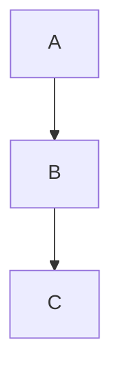

# hold my docs (hmd) — Self-Hosted Wiki

A single-binary, self-hosted wiki. Content lives in a git repository: git is the live source of truth, not a backup. Every save is a commit with auto-push to HTTPS remotes. Split-pane editor with live preview, wiki-links, backlinks, full-text search, and per-page history with revert.

## Quick Start (Docker)

```bash
# Create git_token.txt with your git PAT
echo "your_git_pat_here" > git_token.txt

# Start with docker-compose
docker-compose up
```

Visit http://localhost:8080 and log in with `admin` / `change-me` (see `docker-compose.yaml` to customise).

## Quick Start (Bare Binary)

No Docker required, hmd is a single static binary.

```bash
go build -o hmd .
HMD_BIND=:8080 \
HMD_REPO_DIR=./data/repo \
HMD_APP_DIR=./data/app \
HMD_ADMIN_USER=admin HMD_ADMIN_PASSWORD=change-me \
./hmd
```

The defaults (`/data/repo`, `/data/app`) assume a container; override both for
bare-metal or a home server unless you actually have `/data` set up.

## Configuration

Install-wide settings live in a **YAML file**, `config.yaml`, next to
`users.json` in `HMD_APP_DIR` (default `/data/app/config.yaml`) — created
automatically the first time you save `/settings`, so there's nothing to
provision by hand. It's editable both by hand and from `/settings`.

Two things are env-only out of necessity — they say *where* the config
file lives, so they can't come from the file itself:

| Variable | Meaning |
|----------|---------|
| `HMD_APP_DIR` | Where app state (`users.json`, `sessions.json`, `config.yaml`) lives. **Local disk only, never NFS.** Default `/data/app`. Restart required. |
| `HMD_CONFIG_FILE` | Overrides the config file path (default: `config.yaml` inside `HMD_APP_DIR`). Restart required. |

A couple more are env-only by choice rather than necessity — bootstrap
credentials that felt better left to deploy tooling than a file the app
itself writes to:

| Variable | Meaning |
|----------|---------|
| `HMD_ADMIN_USER` / `HMD_ADMIN_PASSWORD` | Bootstrap admin credentials, used only on first run (creates the user if `users.json` doesn't exist yet). Manage users afterwards with `hmd adduser`. |

Everything else, including secrets like the git token and OIDC client
secret, is a normal field in `config.yaml` (`git.token`, `oidc.client_secret`)
— the `HMD_GIT_TOKEN(_FILE)` / `HMD_OIDC_CLIENT_SECRET` env vars are just an
*optional* override on top, for anyone who'd rather inject secrets via
Docker/k8s secrets than put them in a file next to the app data.

### Configuration file

Every other setting is a key in `config.yaml`, with git, garden, MCP, and
OIDC settings grouped under their own section. See
[`config.yaml.example`](config.yaml.example) for a fully-commented copy.

```yaml
# /data/app/config.yaml
site_name: Homelab Wiki
bind: ":8080"
repo_dir: /data/repo
hostname: homelab
path_label: ~/wiki
max_upload_bytes: 10485760
sync_poll_ms: 10000
# sync_mode: bidirectional  # default: push (local→remote only)
# default_branch: main  # branch name used when initialising a fresh local repo
# home_filename: readme.md  # home page file; default readme.md renders on git host front page

git:
  remote_url: https://git.example.com/you/wiki.git
  user: you
  token_file: /run/secrets/git_token

# OIDC SSO. Register the redirect URI <base_url>/auth/oidc/callback with your
# provider — with the base_url below that is:
#   https://wiki.example.com/auth/oidc/callback
# oidc:
#   issuer: https://auth.example.com
#   client_id: hmd
#   client_secret: change-me  # prefer HMD_OIDC_CLIENT_SECRET (env)
#   local_login: true         # false hides the password form
#   button_text: Login with Authelia
#   icon: authelia             # Dashboard Icons name, or a path to a square SVG
#   base_url: https://wiki.example.com
```

Every key here also has a `HMD_<KEY, upper-cased>` environment variable
equivalent, with nested keys folding their section into the name — e.g.
`repo_dir` ↔ `HMD_REPO_DIR`, `git.remote_url` ↔ `HMD_GIT_REMOTE_URL`,
`oidc.client_id` ↔ `HMD_OIDC_CLIENT_ID`. Handy for Docker/k8s deploys that
inject config via env rather than a mounted file. Env values always win
over the file and are shown read-only in `/settings` with a `set via
HMD_X` badge. Unknown keys in the file are rejected at startup, so a typo
fails loudly instead of being silently ignored.

Theme colours, fonts, and the tags-sidebar toggle are **per-user**
preferences, not install-wide config — see below.

### In-app settings page (`/settings`)

Every install-wide field above is editable from the UI, without restarting
the process for most of them:

- **Live vs restart-required:** `git.remote_url`, `git.user`, `git.token`,
  `git.author`, `sync_mode`, `site_name`, `hostname`, `path_label`,
  `user_label`, upload size, and sync poll interval all apply immediately
  on save. `bind` and `repo_dir` are marked "restart required". `app_dir`
  is bootstrap-only (env var or default) and always read-only.
- **Theme, fonts, tags-sidebar:** per-user, saved to your own `users.json`
  record — colour pickers for all 17 CSS variables (dark and light), font
  pickers, and the sidebar toggle. Each user sets their own; nothing here
  affects other users.
- **`admin_user`/`admin_password`** are bootstrap-only and shown read-only.
  Manage users with `hmd adduser` instead (see Users, below).
- **Re-run setup:** a button that reopens the home-page/help-guide setup
  modal, for re-adding either file if it was deleted later.
- **Help drift warning:** if `.help.md` differs from the binary's built-in
  text (e.g. after upgrading hmd, or a manual edit), a banner appears
  with a "Reset to built-in" button.

## Git Token

### Creating a git PAT

1. Log in to git
2. Settings → Applications → Personal Access Tokens
3. Create a token with `repo` scope
4. Copy the token

### Storage

**Simple:** Set `HMD_GIT_TOKEN` env var (visible via `docker inspect`)
```bash
docker run -e HMD_GIT_TOKEN=pat_xyz ...
```

**Secure (recommended):** Use Docker secrets or mount a file
```bash
echo "pat_xyz" > git_token.txt
# Then use HMD_GIT_TOKEN_FILE=/run/secrets/git_token in docker-compose.yaml
```

The file approach keeps the token out of environment inspection and docker-compose logs.

## Remote URL & Sync

`HMD_GIT_REMOTE_URL` is an HTTPS git remote (e.g.
`https://git.example.com/you/wiki.git`). Auth is HTTPS BasicAuth:
`HMD_GIT_USER` as the username, `HMD_GIT_TOKEN` as the PAT. SSH remotes
are not supported (see Not in v1).

### Sync modes

`HMD_SYNC_MODE` controls the direction of sync:

- **`push` (default):** one-way, local → remote. Every save commits locally
  and async-pushes to `origin`. hmd never pulls; commits made on the remote
  side (or by another writer) will not appear locally.
- **`bidirectional`:** fetch + fast-forward pull on every sync poll and before
  each save. Changes pushed by other writers (agents, another hmd instance,
  direct git commits) appear in the UI automatically. ff-only — if local and
  remote have diverged, the state is reported as `failed` and left for manual
  resolution via git on the server. No merge commits, no conflict markers.

### Startup

- **Repo dir missing, remote set:** hmd clones the remote into `HMD_REPO_DIR`.
- **Empty remote repo:** falls through to a local init, adds `origin`, pushes
  once seeded.
- **Repo dir exists:** hmd opens it and attaches `origin` pointing at
  `HMD_GIT_REMOTE_URL` (no fetch, no merge).
- **No remote set:** local-only repo, sync state stays `no remote`.

### Every save

Each `Save` / `Remove` commits locally, then fires an **asynchronous** push
to `origin`. The save returns immediately; push success or failure is
recorded in the in-memory sync state (not retried). A failed push does not
block the write or surface as a save error — the commit is already local.

In `bidirectional` mode, a fetch + ff pull runs **before** the optimistic-lock
check. If the pull brought in remote changes to the page being saved, the
existing conflict page renders (showing the remote commit as "theirs"), and
the user chooses: overwrite with their version or discard. Other pages'
remote changes come along in the same working tree update.

### Background poll (bidirectional mode)

In `bidirectional` mode, `/api/sync` fetches + ff-pulls on every poll
(every `HMD_SYNC_POLL_MS`, default 10s). Changed pages are returned in the
response. The frontend silently re-renders the currently-viewed page if it
changed (hash check avoids flicker). If the page being **edited** changed
remotely, a banner appears above the editor warning that saving will
conflict.

### Sync state

The statusline sync indicator shows one of: `ok`, `pending`, `failed` (with
the error string), or `no remote`. In `bidirectional` mode the arrow is `⇣⇡`;
in `push` mode it's `⇡`. State is in-memory only; it resets on restart.

### Editing live

`git.remote_url`, `git.user`, `git.token`, `git.author`, and `sync_mode` are all
editable from `/settings` and apply immediately (no restart). Clearing
`git.remote_url` removes the `origin` remote entirely, switching the instance to
local-only mode.

Each user can also set their own commit author (`Name <email>`) from
`/settings`; it overrides `git.author` for that user's commits and is stored in
`users.json`, not the config file.
Env-set values are read-only in the UI.

## First Run Behaviour

Nothing is written to the repo without consent. Every case below just flags
a setup modal (shown on any authed page) if the home file (`HMD_HOME_FILENAME`,
default `readme.md`) and/or `.help.md` is
missing. The modal lists only the files that are actually missing, with a
checkbox per file (checked by default) and "Add selected" / "Skip" buttons.

- **Any repo state** (fresh init, cloned, empty, or existing with other content) that's missing the home file (`HMD_HOME_FILENAME`, default `readme.md`) and/or `.help.md`: shows the setup modal, no auto-seeding, ever
- **Bootstrap users:** if `HMD_ADMIN_USER` and `HMD_ADMIN_PASSWORD` are set, creates that user on startup

The home page (`readme.md` by default) is a clean welcome with a `<!-- hmd:toc -->` token that auto-generates a list of all pages. The help guide lives in `.help.md`, a hidden dot-file, editable via the UI at `/hidden/help` or directly via git. Settings shows a warning if it drifts from the binary's built-in version (e.g. after upgrading hmd), with a button to reset it. Settings also has a "re-run setup" button to reopen the modal if either file is deleted later.

## Storage Layout & NFS

```
/data/
  repo/              ← git repository (safe on NFS)
    readme.md
    .help.md
    some-page.md
    attachments/
      <page-slug>/
        image.png
  app/               ← **LOCAL DISK ONLY** (never NFS)
    users.json       (bcrypt password hashes, per-user prefs, tokens)
    config.yaml      (install-wide settings, editable from /settings)
```

**Why split?** The `app/` directory contains files requiring POSIX advisory locking (user database). SQLite and similar are unreliable over NFS. The `repo/` directory is pure git, which works fine on NFS.

## Users

### Bootstrap on first run
```bash
HMD_ADMIN_USER=admin HMD_ADMIN_PASSWORD=mypass ./hmd
```

### Add users later
```bash
./hmd adduser alice
# Prompts for password
```

Or in Docker:
```bash
docker compose exec hmd /hmd adduser alice
```

(Note: distroless images have no shell, so the form above invokes the binary directly.)

### Personal access tokens
API and MCP clients authenticate with a Bearer token instead of the session cookie. Create tokens under **access tokens** on `/settings`: name the token, pick an expiry (1 day, 7 days, 30 days — the default — 1 year, or never) and copy the value when it is shown — that's the only time it appears. Only a hash is stored. Revoke from the same page; revocation takes effect immediately.

## MCP server

Set `HMD_MCP_ENABLED=true` (restart required) to serve the wiki over the [Model Context Protocol](https://modelcontextprotocol.io/) at `/mcp` (streamable HTTP). MCP clients can then read and write pages directly — every save is a git commit attributed to the token's owner.

Create a token on `/settings` (see [Personal access tokens](#personal-access-tokens)), then configure your MCP client to send it as a Bearer token.

Tools: `list_pages`, `read_page`, `save_page`, `delete_page`, `search`, `backlinks`, `recent_changes`. Saves use the same optimistic locking as the web editor: `save_page` requires the `hash` returned by `read_page`, and a stale hash returns a conflict carrying the current content so the agent can merge and retry.

This makes hmd usable as a persistent agent knowledge base ([LLM wiki](https://gist.github.com/karpathy/442a6bf555914893e9891c11519de94f)-style memory): point your agent's instructions at the wiki conventions you want, and let it compile knowledge into interlinked pages.

## Writing Pages

### Wiki-links
```markdown
See [[My Other Page]] for details.
```

Creates a link to `/page/my-other-page`. If the page doesn't exist, the link shows as "create this page" until you make it.

### Mermaid diagrams
````markdown

````

Renders as an interactive diagram in both preview and final view.

### Image paste/upload
Paste or drag an image into the editor. It uploads to `attachments/<page-slug>/` and inserts markdown:
```markdown

```

### Backlinks
Every page shows "Linked from": a list of pages that link to it via `[[...]]`.

### Table of contents
Insert a TOC token to auto-generate a list of all pages (excluding `home`):
```markdown
<!-- hmd:toc -->
```

Or filter by tags (pages matching ANY tag are included):
```markdown
<!-- hmd:toc:meta -->
```

The token is replaced server-side at render time with wiki-linked bullet points, sorted by title. Use the `toc` button in the editor toolbar to insert the token at the cursor.

### History
Click "History" on any page to see all versions. Click "View" to see an old version, or "Revert to this version" to restore it (creates a new commit, never rewrites history).

### Editor extras
- **Hide preview:** the `preview` toolbar button collapses the preview pane so the source editor fills the width. Useful on smaller screens or when you just want more writing space. Persists across pages (`localStorage`).
- **Zen modes:** Full screen, typewriter scroll, and focus (dims inactive lines). Toggle buttons in the toolbar, or `ctrl shift f` / `ctrl shift t` / `ctrl shift d`.
- **Full shortcut reference:** the built-in help guide at `/hidden/help` lists every editor and navigation shortcut.

## Not in v1

- Real-time collaborative editing (bidirectional sync via `HMD_SYNC_MODE` covers fetch + ff pull, but no live cursors or shared buffers)
- Folder/hierarchical page structure (flat, wiki-link-based only)
- SSO/proxy-header auth (built-in username/password only)
- SSH remotes (HTTPS + PAT only for now)
