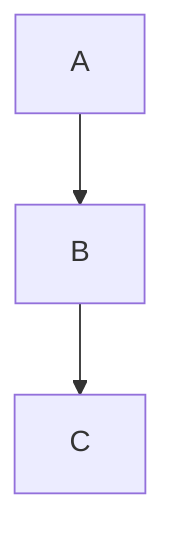

# hold my docs (hmd) — Self-Hosted Wiki

A single-binary, self-hosted wiki backed by a git repository. Git is the live source of truth; every save commits and auto-pushes to HTTPS remotes. Includes a split-pane editor with live preview, wiki-links, backlinks, full-text search, and per-page history with revert.

## Quick Start (Docker)

```bash
# Create git_token.txt with your git PAT
echo "your_git_pat_here" > git_token.txt

# Start with docker-compose
docker-compose up
```

Visit http://localhost:8080 and log in with `admin` / `change-me` (see `docker-compose.yaml` to customise).

## Quick Start (Bare Binary)

No Docker required, hmd is a single static binary.

```bash
go build -o hmd .
HMD_BIND=:8080 \
HMD_REPO_DIR=./data/repo \
HMD_APP_DIR=./data/app \
HMD_ADMIN_USER=admin HMD_ADMIN_PASSWORD=change-me \
./hmd
```

The defaults (`/data/repo`, `/data/app`) assume a container; override both for
bare-metal or a home server unless you actually have `/data` set up.

## Configuration

Install-wide settings live in `config.yaml` beside `users.json` in
`HMD_APP_DIR` (default `/data/app/config.yaml`). hmd creates the file when
you first save `/admin`; edit it by hand or from `/admin`.

Two things are env-only out of necessity — they say *where* the config
file lives, so they can't come from the file itself:

| Variable | Meaning |
|----------|---------|
| `HMD_APP_DIR` | Where app state (`users.json`, `sessions.json`, `config.yaml`) lives. **Local disk only, never NFS.** Default `/data/app`. Restart required. |
| `HMD_CONFIG_FILE` | Overrides the config file path (default: `config.yaml` inside `HMD_APP_DIR`). Restart required. |

Bootstrap credentials are env-only; hmd uses them to create the bootstrap user
and does not write them to the config file:

| Variable | Meaning |
|----------|---------|
| `HMD_ADMIN_USER` / `HMD_ADMIN_PASSWORD` | Bootstrap admin credentials, used only on first run (creates the user if `users.json` doesn't exist yet). Manage users afterwards from `/admin` (see Users, below). |

All other settings, including the git token and OIDC client secret, can be
set in `config.yaml` (`git.token`, `oidc.client_secret`). The
`HMD_GIT_TOKEN(_FILE)` and `HMD_OIDC_CLIENT_SECRET` variables optionally
override those values, allowing Docker/k8s secret injection.

### Configuration file

Instance settings are keys in `config.yaml`, with git, MCP, and
OIDC settings grouped under their own section. See
[`config.yaml.example`](config.yaml.example) for a fully-commented copy.

```yaml
# /data/app/config.yaml
bind: ":8080"
repo_dir: /data/repo
max_upload_bytes: 10485760
sync_poll_ms: 10000
# sync_mode: bidirectional  # default: push (local→remote only)
# default_branch: main  # branch name used when initialising a fresh local repo

git:
  remote_url: https://git.example.com/you/wiki.git
  user: you
  token_file: /run/secrets/git_token

# OIDC SSO. Register the redirect URI <base_url>/auth/oidc/callback with your
# provider — with the base_url below that is:
#   https://wiki.example.com/auth/oidc/callback
# oidc:
#   issuer: https://auth.example.com
#   client_id: hmd
#   client_secret: change-me  # prefer HMD_OIDC_CLIENT_SECRET (env)
#   local_login: true         # false hides the password form
#   button_text: Login with Authelia
#   icon: authelia             # Dashboard Icons name, or a path to a square SVG
#   base_url: https://wiki.example.com
```

Each key also has a `HMD_<KEY, upper-cased>` environment variable equivalent;
nested keys include their section, for example:
`repo_dir` ↔ `HMD_REPO_DIR`, `git.remote_url` ↔ `HMD_GIT_REMOTE_URL`,
`oidc.client_id` ↔ `HMD_OIDC_CLIENT_ID`. Use these for Docker/k8s deployments
that inject configuration rather than mount a file. Environment values
override the file and appear read-only in `/admin` with a `set via
HMD_X` badge. Unknown file keys are rejected at startup.

Skin, palette and fonts are **per-user** preferences, not install-wide
config — see below.

### Wiki configuration

The site name and landing page travel with the content in the repository root:

```yaml
# /data/repo/.wiki.yaml
landing: notes/
site_name: Homelab Wiki
```

`landing` accepts a namespace index such as `notes/`, a page such as
`notes/inbox`, or may be omitted to use the first namespace. Save these values
from the separate **wiki configuration** section of `/admin`; every save is a
git commit, so another hmd instance using the same repository picks them up.

### In-app settings pages (`/settings`, `/admin`)

`/settings` covers your own account — appearance, widgets, git author,
access tokens. `/settings` links to `/admin` for everything
install-wide, below; both require an account with the `settings` scope.

Every instance setting above is editable from `/admin`, without
restarting the process for most of them:

- **Live vs restart-required:** `git.remote_url`, `git.user`, `git.token`,
  `git.author`, `sync_mode`, upload size, and sync poll
  interval all apply immediately on save. `bind` and `repo_dir` are marked "restart required". `app_dir`
  is bootstrap-only (env var or default) and always read-only.
- **Skin, palette, fonts, widgets:** per-user, saved to your own
  `users.json` record. Two independent choices: a **skin** (see Skins,
  below — typography, spacing, markers *and* the widget arrangement) and a
  **palette** (named colour presets: phosphor, catppuccin, dracula,
  everforest, gruvbox, monokai, nord, one dark, rosé pine, solarized, tokyo
  night, each shown as a row of its own swatches). Picking a skin resets the
  palette and the widget checklist to that skin's own defaults; changing
  either afterwards sticks. A widgets checklist lets you add or remove a
  single widget without leaving your skin. Font pickers
  are also here. Each user sets their own; nothing here affects other
  users.
- **`admin_user`/`admin_password`** are bootstrap-only and shown read-only.
- **Wiki configuration:** site name and landing page live in repo-tracked
  `.wiki.yaml`, in a clearly separate `/admin` section rather than the local
  instance config.
  Manage users from the **users** tab instead (see Users, below).
- **Re-run setup:** reopens the setup modal to create a namespace or help
  guide again if needed.
- **Help drift warning:** if `.help.md` differs from the binary's built-in
  text (for example, after an upgrade or manual edit), a banner appears
  with a "Reset to built-in" button.

## Git Token

### Creating a git PAT

1. Log in to git
2. Settings → Applications → Personal Access Tokens
3. Create a token with `repo` scope
4. Copy the token

### Storage

**Simple:** Set `HMD_GIT_TOKEN` env var (visible via `docker inspect`)
```bash
docker run -e HMD_GIT_TOKEN=pat_xyz ...
```

**Secure (recommended):** Use Docker secrets or mount a file
```bash
echo "pat_xyz" > git_token.txt
# Then use HMD_GIT_TOKEN_FILE=/run/secrets/git_token in docker-compose.yaml
```

The file approach keeps the token out of environment inspection and docker-compose logs.

## Remote URL & Sync

`HMD_GIT_REMOTE_URL` is an HTTPS git remote (e.g.
`https://git.example.com/you/wiki.git`). Auth is HTTPS BasicAuth:
`HMD_GIT_USER` as the username, `HMD_GIT_TOKEN` as the PAT. SSH remotes
are not supported (see Not in v1).

### Sync modes

`HMD_SYNC_MODE` controls the direction of sync:

- **`push` (default):** one-way, local → remote. Each save commits locally
  and asynchronously pushes to `origin`; hmd never pulls, so remote commits
  do not appear locally.
- **`bidirectional`:** fetches and performs fast-forward-only pulls on every
  sync poll and before each save. Changes from other writers appear automatically in the UI.
  If local and remote diverge, the state is `failed` and requires manual
  resolution via git on the server. No merge commits or conflict markers.

### Startup

- **Repo dir missing, remote set:** hmd clones the remote into `HMD_REPO_DIR`.
- **Empty remote repo:** falls through to a local init, adds `origin`, pushes
  once seeded.
- **Repo dir exists:** hmd opens it and attaches `origin` pointing at
  `HMD_GIT_REMOTE_URL` (no fetch, no merge).
- **No remote set:** local-only repo, sync state stays `no remote`.

### Every save

Each `Save` / `Remove` commits locally, then fires an **asynchronous** push
to `origin`. The save returns immediately; push success or failure is
recorded in the in-memory sync state (not retried). A failed push does not
block the write or surface as a save error — the commit is already local.

In `bidirectional` mode, a fetch + ff pull runs **before** the optimistic-lock
check. If the pull brought in remote changes to the page being saved, the
existing conflict page renders (showing the remote commit as "theirs"), and
the user chooses: overwrite with their version or discard. Other pages'
remote changes come along in the same working tree update.

### Background poll (bidirectional mode)

In `bidirectional` mode, `/api/sync` fetches + ff-pulls on every poll
(every `HMD_SYNC_POLL_MS`, default 10s). Changed pages are returned in the
response. The frontend silently re-renders the currently-viewed page if it
changed (hash check avoids flicker). If the page being **edited** changed
remotely, a banner appears above the editor warning that saving will
conflict.

### Sync state

The statusline sync indicator shows one of: `ok`, `pending`, `failed` (with
the error string), or `no remote`. In `bidirectional` mode the arrow is `⇣⇡`;
in `push` mode it's `⇡`. State is in-memory only; it resets on restart. Every
transition to `failed` — push, fetch, or a divergent pull — is also logged at
`WARN`, so a stuck sync shows up in the server log even if nobody checks the
statusline.

### Editing live

`git.remote_url`, `git.user`, `git.token`, `git.author`, and `sync_mode` are all
editable from `/settings` and apply immediately (no restart). Clearing
`git.remote_url` removes the `origin` remote entirely, switching the instance to
local-only mode.

Each user can also set their own commit author (`Name <email>`) from
`/settings`; it overrides `git.author` for that user's commits and is stored in
`users.json`, not the config file.
Env-set values are read-only in the UI.

## First Run Behaviour

The repo is never written without consent. If the repo holds no namespace to
file pages in, lacks `.wiki.yaml`, or `.help.md` is missing, hmd shows a setup
modal on any authenticated page. When `.wiki.yaml` is missing, it lists the
detected namespaces and asks which should be the default, with an option to
create and name a new namespace instead.

Choosing a new namespace writes its `.namespace.yaml` (with `index: readme`),
a welcome page as that index, a plain `readme.md` at the repo root for the git
host's front page, and `.wiki.yaml` pointing `/` and every login there.

- **Any repo state** (fresh init, cloned, empty, or existing with other
  content): shows the setup modal when any required setup file is missing; no automatic
  seeding.
- **Bootstrap users:** if `HMD_ADMIN_USER` and `HMD_ADMIN_PASSWORD` are set, creates that user on startup

The seeded index page contains a `<!-- hmd:toc -->` token that lists every
page in its namespace. The help guide is `.help.md`, a hidden
dot-file editable at `/hidden/help` or via git. Settings warns when it differs
from the binary's built-in version and offers a reset button. A "re-run setup"
button reopens the modal if either file is later deleted.

## Storage Layout & NFS

```
/data/
  repo/              ← git repository (safe on NFS)
    readme.md        (git host front page, not a wiki page)
    .wiki.yaml       (portable site name and landing page)
    .help.md
    notes/           ← a namespace
      .namespace.yaml
      readme.md      (its index page)
      some-page.md
    attachments/
      <page-slug>/
        image.png
  app/               ← **LOCAL DISK ONLY** (never NFS)
    users.json       (bcrypt password hashes, per-user prefs, tokens)
    config.yaml      (install-wide settings, editable from /settings)
```

**Why split?** The `app/` directory contains files requiring POSIX advisory locking (user database). SQLite and similar are unreliable over NFS. The `repo/` directory is pure git, which works fine on NFS.

**Per-user preferences** — skin, palette, fonts, widget add/remove, commit
author, and access-token hashes — live in that user's own record in
`users.json` under `app/`, not in `config.yaml`. They are therefore per-user
and local-disk-only, same as the rest of `app/`. `config.yaml` holds only
the install-wide `skin:` default (see Skins, below).

## Skins

A skin controls the app's presentation: typography, spacing, borders,
markers, statusline segments, and colour palette. It does not decide which
widgets mount (that's a namespace property, see Namespaces), where `/`
lands or whether ctrl-j is live (both wiki-config/namespace properties, see
below). The same repo works under any skin, and `git log` remains
byte-identical.

- **`phosphor`** (default, phosphor palette) — terminal: green, monospace,
  `#` markers, a `<user>@<site_name>$` prompt.
- **`newsprint`** (solarized) — broadsheet: a masthead instead of a prompt,
  serif, justified columns, drop cap, kicker headings in place of `##`.
- **`journal`** (everforest) — writing first: serif, a wide relaxed measure,
  generous leading, no panel chrome.
- **`soft`** (rosé pine) — rounded and low-contrast: a warm sans, roomy
  leading, filled panels with their borders mixed back toward the fill, no
  markers or prompt. The one skin here that isn't austere.
- **`bare`** (one dark) — subtraction only: no borders, no markers, wide
  margins.

Each skin names its default **palette**, and choosing a skin switches to that
palette. The palette picker remains available, so every skin × palette
combination is still possible; the pairing is the default.

The install-wide default is `skin:` in `config.yaml` (env `HMD_SKIN`); each
user can override their own from `/settings`, including adding or removing a
single widget without leaving the skin.

## Users

### Sessions

Logging in (password or SSO) mints a session token stored server-side in
`sessions.json`, independent of the browser cookie's own lifetime (a plain
session cookie, or 30 days with "remember me"/SSO). The server-side session
itself always expires 30 days after login, so a copied or leaked token
can't be replayed indefinitely even if the cookie persists longer. Logging
out revokes the token immediately; there is no separate idle timeout.

### Bootstrap on first run
```bash
HMD_ADMIN_USER=admin HMD_ADMIN_PASSWORD=mypass ./hmd
```

### Add users later

From `/admin` → **users** (needs an account with `settings` scope):
the **new user** form takes a name, password and scopes, and creates the
user immediately — no CLI or restart needed.

### Scopes

Every user has full read/write/settings access by default. Each user other
than the bootstrap admin has a `read`/`write`/`settings` checkbox row in the
**users** tab, ticked to their current access; save with only some ticked to
restrict them to exactly those scopes, or untick all three to restore full
access. Valid scopes: `read` (view pages, search), `write` (save, rename,
tag, upload), and `settings` (Administrator access: every scope, namespace,
and settings route). A request outside a user's scopes gets `403 Forbidden`.

The bootstrap admin (`HMD_ADMIN_USER`) always keeps full access and isn't
listed with editable checkboxes — it's the one account that can't be
recreated from the UI, so it can't be locked out either. To restrict an
administrator's own account, create a second user instead. Any other user
also can't remove their own `settings` scope, since that would lock them
out with no CLI left to undo it.

### Personal access tokens
API and MCP clients use Bearer tokens instead of the session cookie. Create one
under **access tokens** on `/settings`, choose one or more scopes, a name and
expiry (1 day, 7 days, 30 days — default, 1 year, or never), and copy it when
shown; it appears only once. hmd stores only a hash. Revoke tokens from the
same page; revocation is immediate.

Token scopes can never exceed the owning user's scopes. A token with `read` or
`write` may optionally be restricted to selected namespaces; leaving the
namespace selection blank gives it all namespaces. A selected namespace list
restricts every non-administrative Bearer request, including page, search and
MCP access. Restricted tokens cannot access general settings.
Selecting `settings` makes the token an unrestricted **Administrator**, even if
namespaces were selected. Tokens created before per-token scopes were added
retain their inherited user scopes and all namespaces.

## MCP server

Set `HMD_MCP_ENABLED=true` (restart required) to serve the wiki over
[Model Context Protocol](https://modelcontextprotocol.io/) at `POST /_/mcp`.
HMD supports only MCP `2026-07-28`: clients must send
`MCP-Protocol-Version: 2026-07-28`, request metadata, and use
`server/discover`. Legacy `initialize`, sessions, `GET`, and `DELETE` are
rejected. Disabled MCP returns `404`; every non-POST request returns `405`.

Use a client that supports this protocol revision and configure it with a
Bearer token created under **access tokens** on `/settings` (see [Personal
access tokens](#personal-access-tokens)). Agents can read and write pages; each
save is a Git commit attributed to the token owner.

| Scope | Tools |
| --- | --- |
| `read` | `list_pages`, `read_page`, `search`, `backlinks`, `recent_changes`, `health` |
| `write` | `save_page`, `delete_page` |

MCP exposes ordinary pages only, never `.wiki.yaml`, `.namespace.yaml`, hidden
templates or attachments. `save_page` uses the same optimistic locking as the
web editor: read first, then pass the returned hash as `basehash`. A stale hash
returns current data for merging and retrying.

Browser requests must use HMD's public Origin. A reverse proxy must preserve
the public Host and Origin values so standard Origin protection can validate
them; non-browser clients authenticate with their Bearer token.

hmd is a persistent agent knowledge base ([LLM wiki](https://gist.github.com/karpathy/442a6bf555914893e9891c11519de94f)-style memory): use `search` to find
candidate pages through the derived Bleve index, `read_page` for canonical
Markdown and its hash, then `save_page` with that hash. Markdown and Git remain
canonical; Bleve is the rebuildable search projection, not a second memory
store or vector database.

## Writing Pages

### Wiki-links
```markdown
See [[My Other Page]] for details.
```

Links to `/page/my-other-page`. Missing pages show "create this page" until created.

### Mermaid diagrams
````markdown

````

Renders as an interactive diagram in both preview and final view.

### Image paste/upload
Paste or drag an image into the editor. It uploads to `attachments/<page-slug>/` and inserts markdown:
```markdown

```

### Backlinks
Every page shows "Linked from": a list of pages that link to it via `[[...]]`.

### Table of contents
Insert a TOC token to auto-generate a list of all pages (excluding `home`):
```markdown
<!-- hmd:toc -->
```

Or filter by tags (pages matching ANY tag are included):
```markdown
<!-- hmd:toc:meta -->
```

At render time, the server replaces the token with wiki-linked bullet points
sorted by title. Use the editor toolbar's `toc` button to insert it at the
cursor.

### History
Click "History" on any page to see all versions. Click "View" to see an old version, or "Revert to this version" to restore it (creates a new commit, never rewrites history).

### Optional frontmatter keys

Beyond `title`/`tags`/`public`, a few keys feed the pinned, inbox, sources
and source-card widgets. No skin mounts those four by default — tick them on
the `/settings` widgets checklist if you use these keys. All are optional,
ignored where irrelevant, and round-trip untouched through an ordinary
editor save even though there's no dedicated editor UI for them yet — set
them by hand in the frontmatter block, or via the MCP `save_page` tool.

- `pin: true` — surfaces the page in the pinned sidebar widget.
- `unread: true` — surfaces the page in the inbox widget and the `/inbox` route.
- `source: https://example.com/article` — the page's origin URL; grouped by host in the sources widget, shown on the source-card widget.
- `author: Jane Doe` — shown on the source-card widget.
- `read_time: 4 min` — shown on the source-card and inbox widgets.

### Editor extras
- **Hide preview:** the `preview` toolbar button collapses the preview pane so the source editor fills the width. Useful on smaller screens or when you just want more writing space. Persists across pages (`localStorage`).
- **Zen modes:** Full screen, typewriter scroll, and focus (dims inactive lines). Toggle buttons in the toolbar, or `ctrl shift f` / `ctrl shift t` / `ctrl shift d`.
- **Full shortcut reference:** the built-in help guide at `/hidden/help` lists every editor and navigation shortcut.

## Not in v1

- Real-time collaborative editing (bidirectional sync via `HMD_SYNC_MODE` covers fetch + ff pull, but no live cursors or shared buffers)
- Folder/hierarchical page structure (flat, wiki-link-based only)
- SSO/proxy-header auth (built-in username/password only)
- SSH remotes (HTTPS + PAT only for now)
