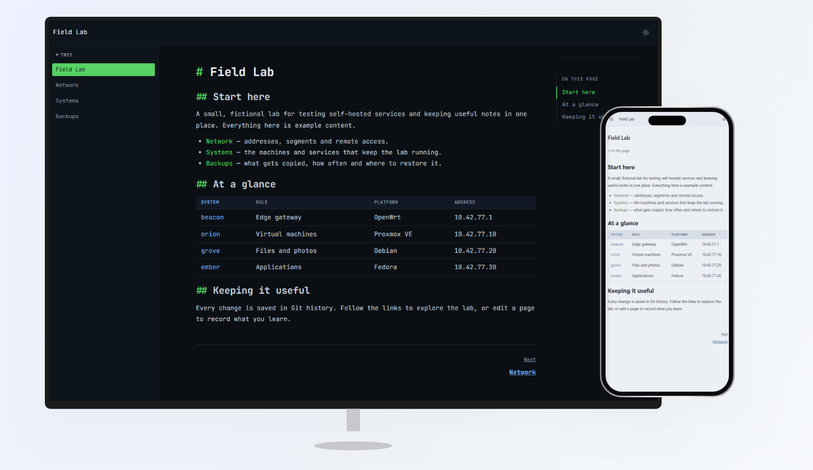
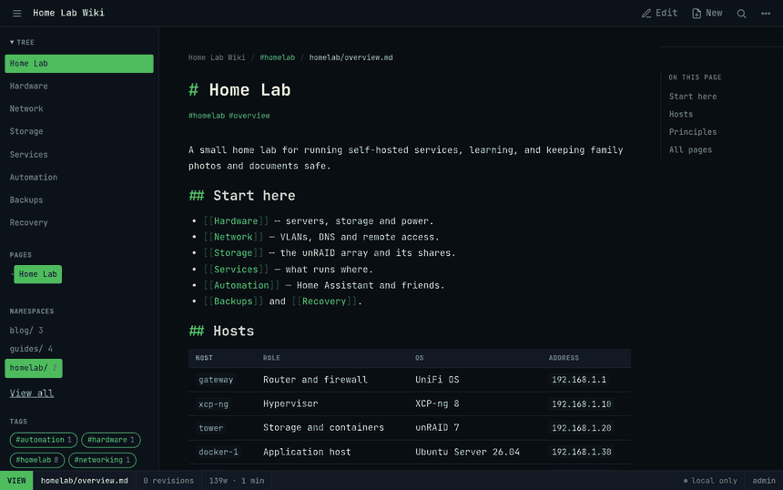
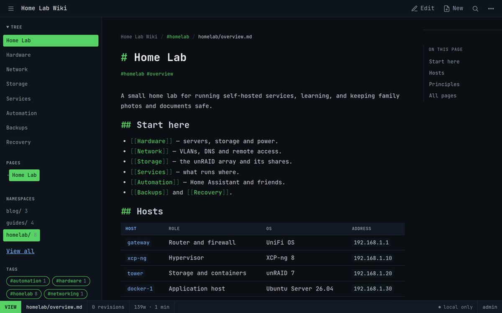
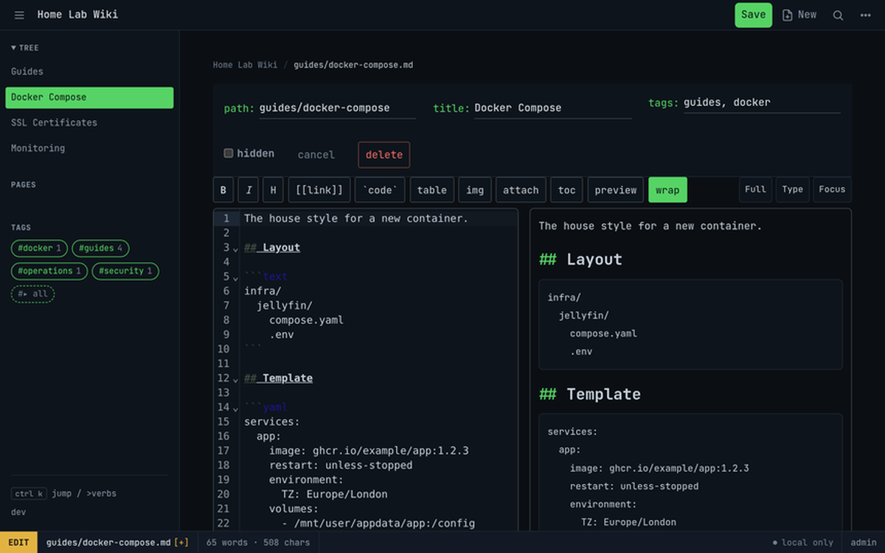
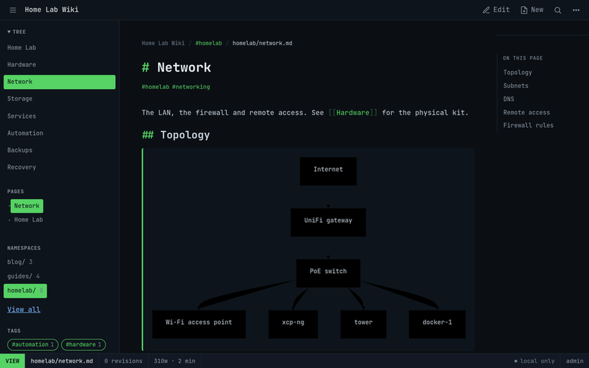
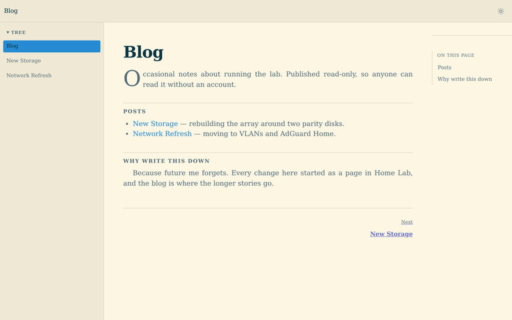

# Hold My Docs

**A self-hosted, Git-backed wiki for documentation, knowledge bases, and agent memory.**

Hold My Docs (HMD) runs as a single Go binary and keeps your content as Markdown in an ordinary Git repository. Every save is a commit, so your docs have real history and can sync to a remote you already use.



## Features

- **Git is the source of truth.** Every save is a commit; optionally push to and pull from a remote.
- **Namespaces** for per-area visibility, navigation, appearance, and page-creation defaults.
- **A real editing experience.** Split-pane Markdown editor with live preview, wiki-links, backlinks, full-text search, Mermaid diagrams, attachments, history, and revert.
- **Documents, not just text.** With an operator-supplied Apache Tika Server, PDF and Office attachments get local hybrid keyword and semantic search.
- **Flexible access.** Local accounts, OIDC single sign-on, access scopes, and personal access tokens.
- **Agent-ready.** An MCP server lets authorised agents read and write ordinary pages, with optional namespace-filtered attachment search.
- **Publish anywhere.** Static export publishes a namespace without a running HMD instance.

## Quick start

### Docker Compose

```sh
export HMD_ADMIN_USER=admin
export HMD_ADMIN_PASSWORD='use-a-unique-password-of-at-least-12-characters'
docker compose up -d
curl -f http://127.0.0.1:8080/_/ready
```

Open <http://localhost:8080> and sign in with the bootstrap credentials. Remove the bootstrap environment variables after the first successful start.

The Compose file starts a local-only instance and binds it to loopback. It runs as UID/GID 65532 with a read-only root filesystem and limits the service to 1 CPU, 512 MiB, and 128 processes. To sync to a Git remote, create `./git_token.txt` and uncomment the `HMD_GIT_*` variables and the `git_token` secret. To enable the internal-only Apache Tika service for document search, uncomment `HMD_TIKA_URL` and run with `docker compose --profile documents up`. Keep Tika private and use a dedicated sandbox with parser-specific limits when processing hostile documents.

### Bare binary

```sh
go build -o hmd ./cmd/hmd
HMD_BIND=:8080 \
HMD_REPO_DIR=./data/repo \
HMD_APP_DIR=./data/app \
HMD_ADMIN_USER=admin HMD_ADMIN_PASSWORD='use-a-unique-password-of-at-least-12-characters' \
./hmd
```

On first start, HMD downloads a pinned, checksum-verified `BAAI/bge-small-en-v1.5` ONNX model into `<HMD_APP_DIR>/models` when document search is enabled. `HMD_REPO_DIR` holds the Git-backed content and can be on network storage; keep `HMD_APP_DIR` on local disk — it contains application state and must not be on NFS.

## Screenshots



| | |
| --- | --- |
|  |  |
|  |  |

More stills, including search, namespace management and the tag index, live in [`docs/screenshots/`](docs/screenshots/).

## Documentation

Full documentation — installation, configuration, operations, MCP, and development guides — lives on the HMD docs site.

> **Docs site:** `https://docs.example.com` — placeholder, to be replaced when the site launches.

## License

MIT. See [LICENSE](LICENSE).
